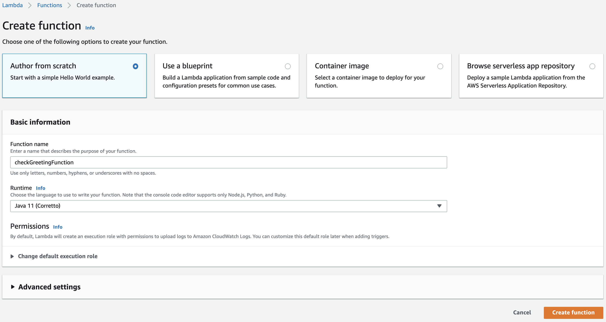
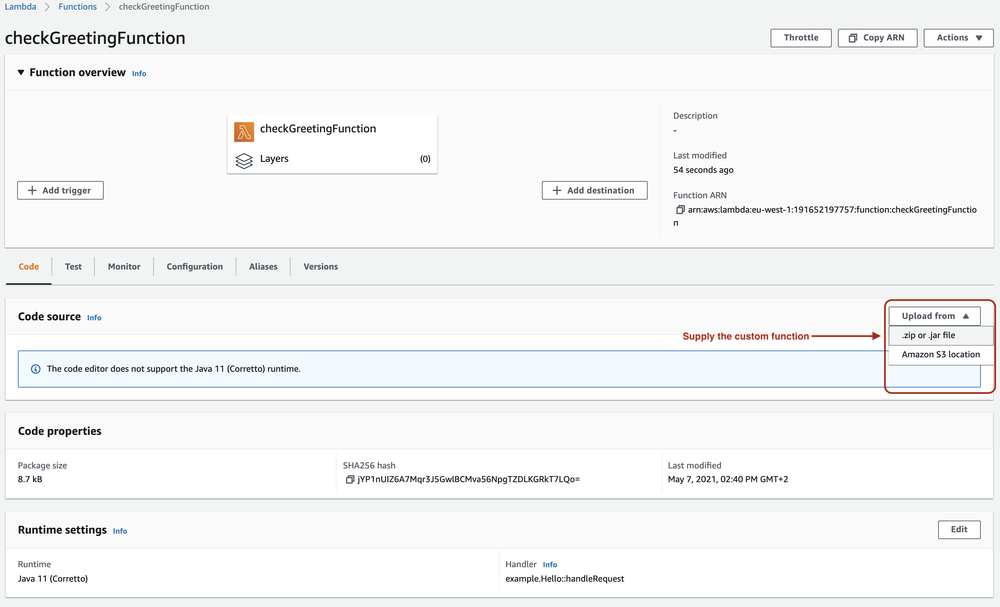
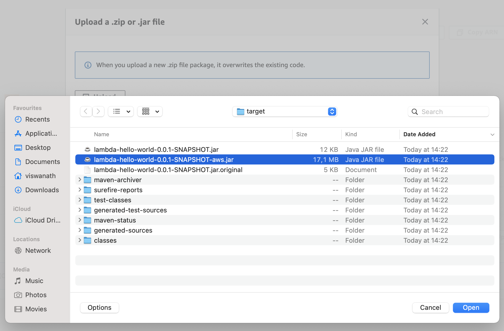
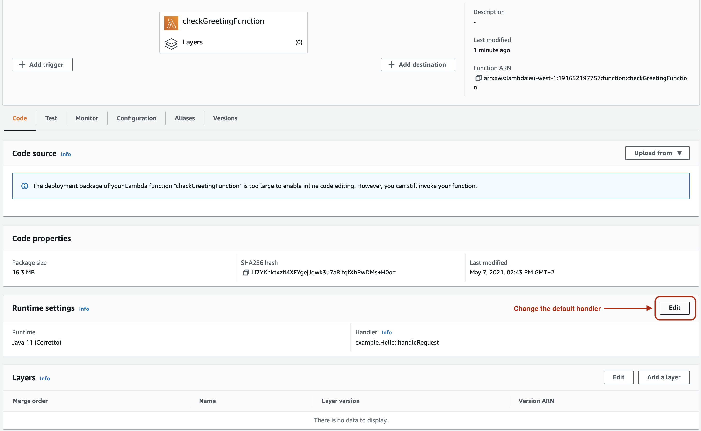
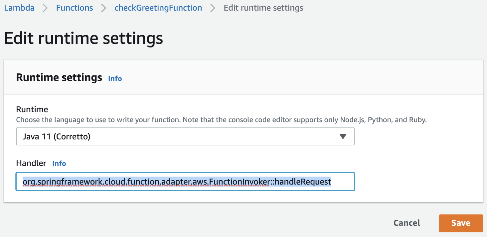
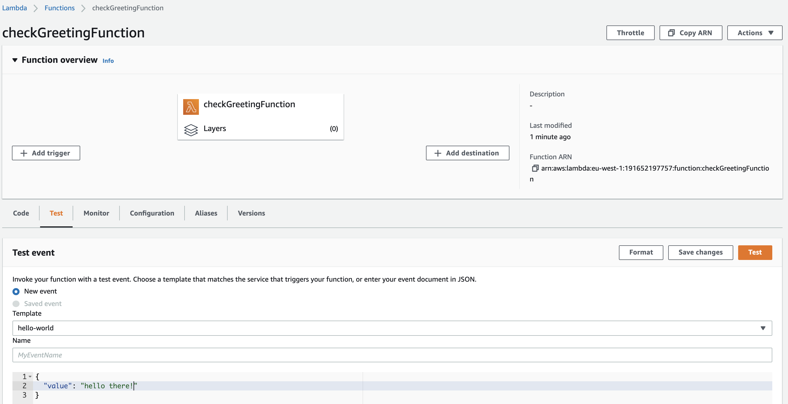
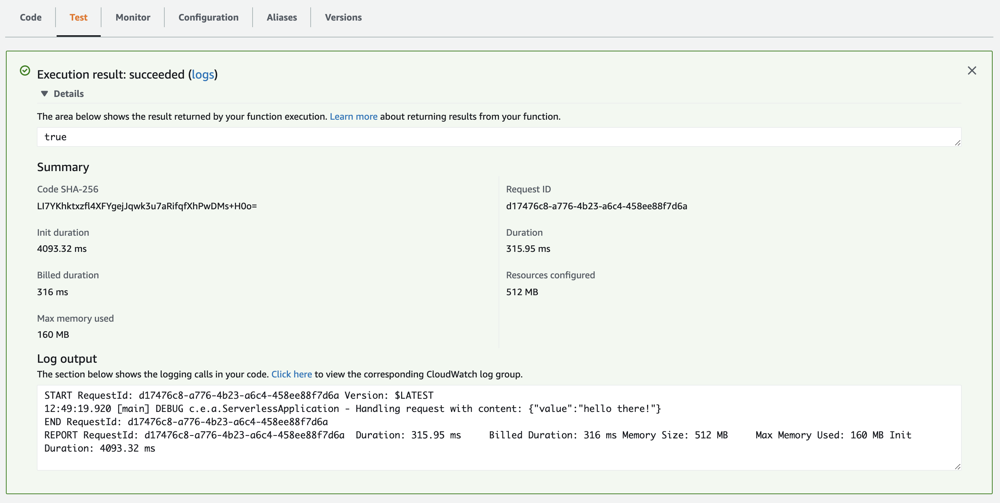

# Objective 

The objective of this project is to show case the usage of spring cloud function in AWS using lambda functions.

## Usage 

- Build the project by issuing the command `mvn clean package`
- Deploy the function to AWS as lambda function
    * Create a function
      
      
      
    * Select the function's jar package
      
      
      
      
    
    * Edit the runtime settings by specifying the spring handler function
      
      
      
      
      
    * Test the function and verify the result
      
      
      
      

